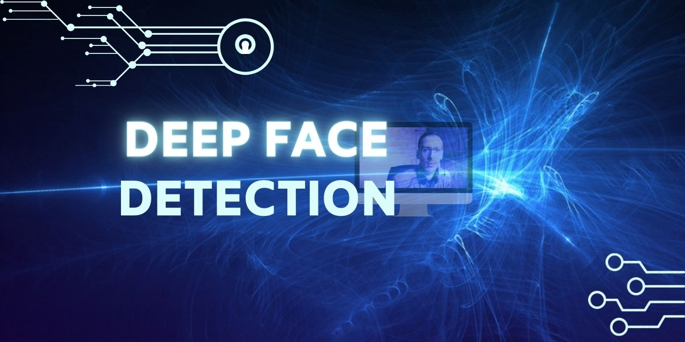

# Deep Face Detection 
<strong>by Abdellah Ait Ahmed Ouaal</strong>
    



## Project Overview

In this Deep Face Detection project, we aim to create an advanced system for facial recognition using computer vision and deep learning techniques. We start by carefully setting up our environment and capturing facial images using OpenCV and a webcam. These images are then precisely labeled with Labelme to identify and mark the face. Moving forward, we focus on data preparation, constructing an image loading function, and organizing the dataset for training and testing purposes. To improve the dataset's variety, we use Albumentations for image augmentation. Transitioning to the core of the project, we build and train a deep learning model using the Functional API, define customized loss functions, and optimize for efficient learning. The project concludes with a thorough evaluation of real-time face detection performance. 

## Project Structure

1. *Data Collection and Annotation*
2. *Review Dataset and Build Image Loading Function*
3. *Partition Unaugmented Data*
4. *Apply Image Augmentation on Images and Labels using Albumentations*
5. *Build and Run Augmentation Pipeline*
6. *Prepare Labels*
7. *Combine Label and Image Samples*
8. *Build Deep Learning using the Functional API*
9. *Define Losses and Optimizers*
10. *Train Neural Network*
11. *Make Predictions*

## Project Highlights

- **Image Collection and Annotation**: 200 facial images were captured using OpenCV and a webcam. These images were meticulously annotated using Labelme to identify and mark the faces.

- **Data Preparation and Augmentation**: The dataset was carefully organized, and image augmentation by 100 times was performed using Albumentations to enhance its diversity.

- **Deep Learning Model**: A deep learning model was built using the Functional API, utilizing the VGG16 architecture for face detection.

- **Customized Loss Functions**: Specialized loss functions were defined for classification and localization to optimize the training process.

- **Real-Time Face Detection**: The project concludes with the evaluation of real-time face detection performance, showcasing the practical utility of the developed system.

## Project Scope

The project is scalable, allowing for future enhancements and accommodating larger datasets.  
The application of cutting-edge computer vision and deep learning techniques ensures precise and versatile face detection across various scenarios.

## Getting Started

Follow these steps to replicate the project:

1. **Clone the Repository**: Clone this repository to your local machine using the following command:
   ```bash
    git clone https://github.com/Abdellah-Ait-Ahmed-Ouaal/Deep_Face_Detection.git  
      
3. **Setup Environment**: Install the required dependencies by running the following command:
   ```bash
   pip install labelme tensorflow opencv-python matplotlib albumentations 
     
4. **Navigate to the Project Directory**: Change into the project directory:
   ```bash
   cd your-repository
    
5. **Create Directories**: Create the necessary directories for the dataset and augmented data:
    ```bash
    mkdir data data/images data/labels data/train/images data/train/labels data/test/images data/test/labels data/validation/images data/validation/labels aug_data aug_data/train/images aug_data/train/labels aug_data/test/images aug_data/test/labels aug_data/validation/images aug_data/validation/labels
      
6. **Execute Jupyter Notebook**:
   Open and run the Jupyter Notebook provided in the repository. The notebook will guide you through the different stages of the project.
   
## License

This project is not licensed.

## Acknowledgments

- [OpenCV](https://opencv.org/)
- [Labelme](https://github.com/wkentaro/labelme)
- [Albumentations](https://albumentations.ai/)
- [TensorFlow](https://www.tensorflow.org/)
- Shoutout to [Nicholas Renotte's](https://www.youtube.com/@NicholasRenotte) YouTube channel for insightful tutorials and guidance in the field of deep learning and computer vision
